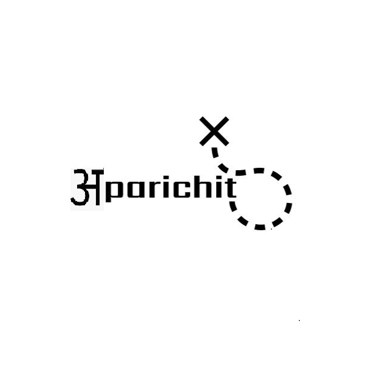
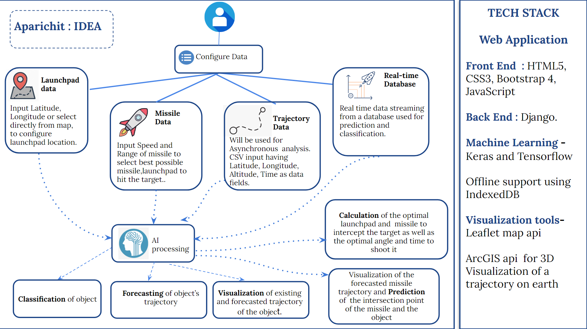
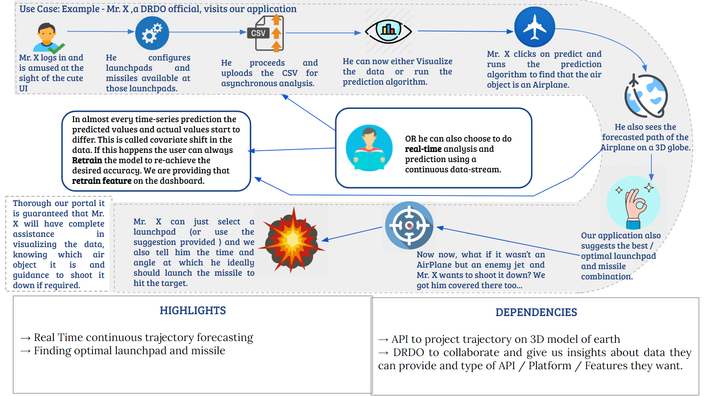
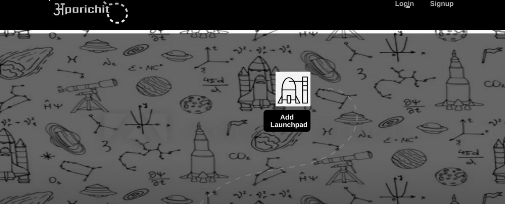
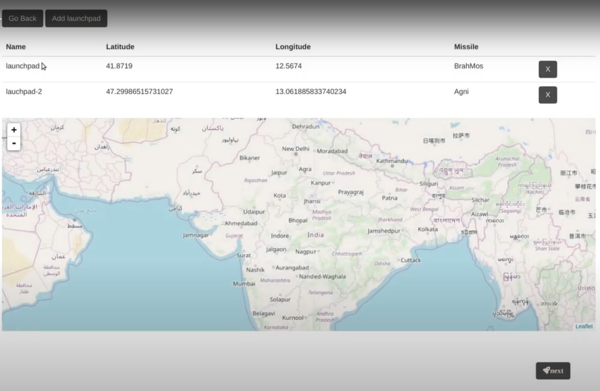
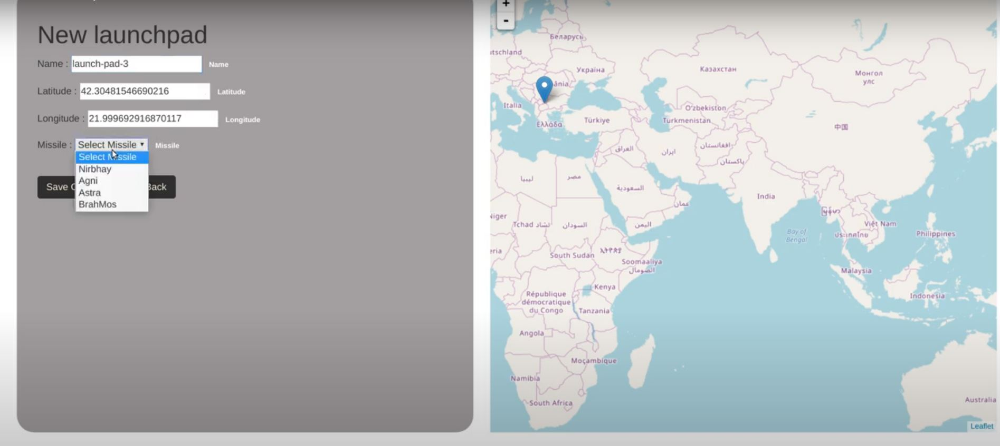
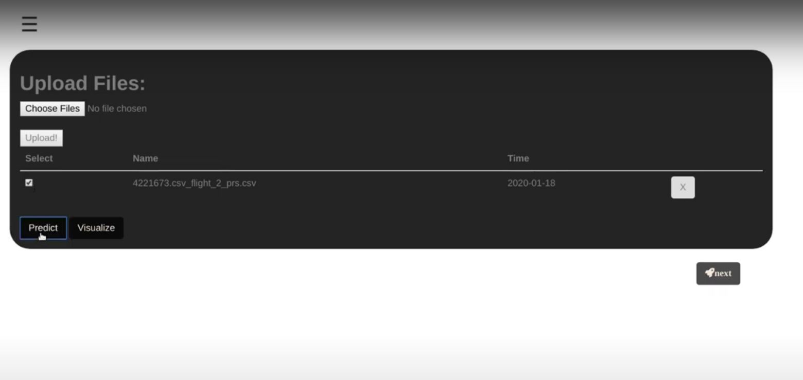
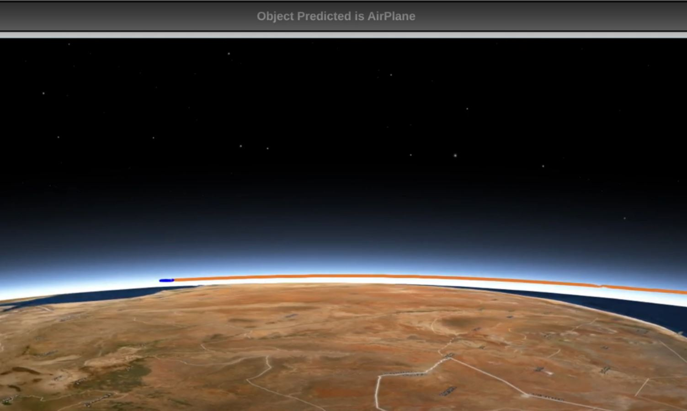

<center>

</center>

## Problem:

- The position of an object in the air can be indicated by latitude, longitude and altitude for a given time. 
- A trajectory is a stream of such quadruples (time, latitude, longitude and altitude). 
- Given a large set of such trajectories, without any other information, problem is to cluster them into meaningful objects such as Helicopter, Fighter/civilian Aircraft, UAV, Cruise Missile, dropped bomb, etc. 
- An optimal scalable solution is desired using open source tools. 
- Design a system to estimate location of flying object based on its trajectory, provide guidance to missile to shoot them depending on their location when missile will meet the object on its trajectory.


## Solution: 
<br>

<br>
<br>

<br>

## How to run the application?

```sh
git clone https://github.com/akatsukiSih2020/aparichit.git

# start your virtual env here (recommended, not compulsory)
pip install -r requirements.txt

python manage.py makemigrations
python manage.py migrate

python manage.py runserver

# what to do next? Have a look at our UI below and see if you can get it working on your system...
```

## What will I see after a successfull run ?

- Homepage :  

- Add and configure launchpad/s : 
    
    <br>
    

- Upload Data Page: 

- After successfull Prediction : 


### NOTE: 
- Project Made in less than a week.
- Hurdles?

        - Getting Data and then E.T.L of data
        - Path forecasting model
        - Map visuals

- Contributions are more than welcome :D 


<footer>
Made with :heart: by Team Akatsuki :sunglasses:
</footer>